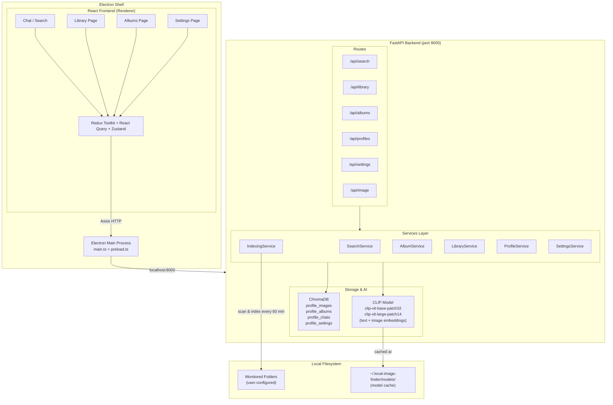

# Local Image Finder

> A cross-platform Electron desktop app for intelligent, privacy-first local image search — powered by CLIP vision-language models and semantic vector embeddings. No cloud. No accounts. Everything runs on your machine.


---

## Overview

Local Image Finder lets you search your photo library the way you think — type "kids at the beach last summer" or drop in a reference photo, and the app finds visually and semantically matching images from your local folders. All AI inference runs on-device using OpenAI CLIP and sentence-transformers, so your images never leave your machine.

Built for photographers, designers, and power users who manage large local image collections and want a native desktop experience without sacrificing privacy.

---

## Demo

**LinkedIn Post Demo:** [View on LinkedIn](https://www.linkedin.com/posts/quy-hoang-nguyen_semanticsearch-ai-productivity-ugcPost-7323267030881644544-gIE5?utm_source=share&utm_medium=member_desktop&rcm=ACoAACiv4GUBQbI6U4VojWpXCAscABxv5B2TCrc)

<video src="docs/demo.mp4" autoplay loop muted playsinline controls width="100%"></video>

---

## Highlights

- **Natural language image search** — query your entire photo collection with plain English using CLIP's text encoder, keeping text and image queries in the same shared embedding space
- **Visual similarity search** — drop in a reference image and find visually similar photos via OpenAI CLIP (`clip-vit-base-patch32` / `clip-vit-large-patch14`)
- **Combined text + image queries** — fuse both modalities into a single embedding vector for multi-signal search
- **Background folder indexing** — a scheduler watches configured directories every hour, hashing images by path to avoid re-indexing
- **Profile-isolated data** — each user profile maintains its own ChromaDB collections, search history, albums, and settings independently
- **Configurable AI quality tiers** — choose between Performance, Default, and Quality model presets to balance speed vs. accuracy on your hardware
- **100% offline** — no external API calls, no telemetry, no accounts; models are cached locally in `~/.local-image-finder/models`

---

## Use Cases

| Use Case | User | Outcome |
|----------|------|---------|
| Find all photos of a specific person or scene | Photographer with 50k+ files | Instant semantic retrieval without manual tagging |
| Locate a reference image by visual similarity | Designer | Upload a style reference, retrieve visually matched local assets |
| Audit past search sessions | Any user | Browse Library page to resume or review prior searches |
| Separate work and personal photo collections | Multi-user household | Switch profiles to get isolated history and folder configs |

---

## Features

### Search
- Text-to-image semantic search via NLP embeddings
- Image-to-image visual similarity search via CLIP
- Combined text + image multi-modal search (embeddings fused by averaging and L2 normalization)
- Per-profile configurable similarity threshold (default 0.7)
- "Related images" from any result for discovery

### Organization
- Chat-style search interface with full session history persisted in ChromaDB
- Library page: visual grid of past sessions, each showing query and image previews
- Albums: create collections manually or auto-generate from search criteria
- EXIF metadata extraction (dimensions, dates, camera data)

### Indexing
- Recursive directory scanning for `.jpg`, `.jpeg`, `.png`, `.gif`, `.bmp`, `.tiff`, `.webp`
- MD5-based image ID for deduplication across indexed runs
- Per-profile monitored folders; configurable scan interval (default: 60 minutes)
- Health check and indexing status tracking per profile

### Settings
- Configure watched folders per profile
- Select NLP and VLM model quality tiers independently
- Adjust similarity threshold, result count limits
- Light / Dark / System theme modes

---

## Tech Stack

| Layer | Technology | Purpose |
|-------|------------|---------|
| Desktop shell | Electron 30 | Cross-platform window management and native OS integration |
| Frontend framework | React 18 + TypeScript 5.5 | UI component tree |
| Build tooling | Vite 5 + vite-plugin-electron | Fast HMR dev server and production bundler |
| Styling | Tailwind CSS 3 + Radix UI | Utility-first styles with accessible headless components |
| Animations | Framer Motion 12 | Page transitions and micro-interactions |
| State management | Redux Toolkit + Zustand | Global state (Redux) and lightweight local state (Zustand) |
| Server state | TanStack React Query 5 | API data fetching, caching, and sync |
| Routing | React Router v6 | Client-side page navigation |
| Charts | Recharts | Usage analytics visualizations |
| Icons | Lucide React | Consistent icon set |
| Backend API | Python FastAPI (port 8000) | REST API with async request handling |
| Vector database | ChromaDB | Embedding storage and approximate nearest-neighbor search |
| Vision-language model | OpenAI CLIP (via HuggingFace Transformers) | Both image and text embeddings via shared CLIP encoder; `clip-vit-base-patch32` / `clip-vit-large-patch14` |
| Text embeddings | sentence-transformers | Loaded as a dependency; CLIP text encoder is used for search queries to keep embeddings in the same space |
| Image processing | Pillow | Image loading, EXIF extraction, preprocessing |
| ML runtime | PyTorch | Inference backend; auto-detects CUDA when available |
| HTTP client | Axios | Frontend-to-backend API calls |
| Packaging | electron-builder | Produces `.dmg`, `.exe` (NSIS), and `.AppImage` installers |

---

## Architecture



---

## How It Works

1. **Folder indexing** — On startup and every 60 minutes, the `IndexingService` scans all monitored directories. Each image gets an MD5-based ID and is processed through CLIP to generate a normalized embedding vector, which is upserted into ChromaDB along with file metadata and EXIF data.

2. **Text search** — The user types a natural language query. `SearchService` encodes it with CLIP's text encoder into a dense vector in the same embedding space as indexed images, then queries ChromaDB for nearest neighbors by cosine distance. Results below the configured similarity threshold are filtered out.

3. **Visual search** — The user uploads a reference image. CLIP encodes the image into the same shared embedding space, enabling direct comparison with all indexed images regardless of textual metadata.

4. **Multi-modal search** — When both text and images are provided, their embeddings are averaged and L2-normalized into a single fused vector before querying ChromaDB.

5. **Session persistence** — Each search creates a new chat session in ChromaDB (per profile), storing the query, embedding, and result set so the Library page can replay or resume any past session.

6. **Result delivery** — The FastAPI backend returns ranked results with similarity scores. The React frontend renders them in the chat-style Search page with image previews, metadata overlays, and related-image suggestions.

---

## Getting Started

### Prerequisites

- Node.js v16 or higher
- Python v3.10 or higher
- pip

> **Note:** PyTorch and the CLIP/sentence-transformer models are downloaded automatically on first run into `~/.local-image-finder/models/`. Expect ~1-2 GB depending on the selected model tier. GPU inference via CUDA is used automatically if available.

### Installation

```bash
# 1. Clone the repository
git clone https://github.com/yourusername/local-image-finder.git
cd local-image-finder

# 2. Install backend dependencies
cd backend
pip install -r requirements.txt

# 3. Install frontend dependencies
cd ../frontend
npm install
```

### Running the App

```bash
# From the frontend directory:

# Web-only dev mode (Vite dev server, no Electron shell)
npm run dev

# Electron development mode (full desktop app with hot reload)
npm run electron:dev
```

### Building a Distributable

```bash
# From the frontend directory:
npm run electron:build
```

This produces platform-specific installers in `frontend/release/<version>/`:
- **Windows** — `Local Image Finder-Windows-<version>-Setup.exe` (NSIS)
- **macOS** — `Local Image Finder-Mac-<version>-Installer.dmg`
- **Linux** — `Local Image Finder-Linux-<version>.AppImage`

### Starting the Backend Separately (for development)

```bash
cd backend
python main.py
# API available at http://127.0.0.1:8000
# Swagger docs at http://127.0.0.1:8000/docs
```

---

## Project Structure

```
local-image-finder/
├── backend/
│   ├── main.py                        # FastAPI app, CORS config, router registration
│   ├── requirements.txt
│   └── app/
│       ├── routes/                    # API route handlers
│       │   ├── search_router.py       # /api/search — text, image, combined search
│       │   ├── library_router.py      # /api/library — session history
│       │   ├── albums_router.py       # /api/albums — album CRUD
│       │   ├── settings_router.py     # /api/settings — folder config, AI params
│       │   ├── profiles_router.py     # /api/profiles — user profile management
│       │   └── image_router.py        # /api/image — metadata and file operations
│       ├── services/
│       │   ├── search_service.py      # Text, image, combined search logic
│       │   ├── indexing_service.py    # Directory scanning, embedding generation, scheduler
│       │   ├── album_service.py       # Album creation and management
│       │   ├── library_service.py     # Search session persistence
│       │   ├── profile_service.py     # Profile CRUD
│       │   └── settings_service.py   # Settings persistence
│       ├── database/
│       │   ├── chroma_client.py       # ChromaDB connection
│       │   ├── image_repository.py    # Image CRUD and vector queries
│       │   ├── chat_repository.py     # Chat/session persistence
│       │   ├── album_repository.py    # Album data access
│       │   └── profile_repository.py  # Profile data access
│       ├── models/                    # Pydantic request/response models
│       │   ├── profiles_model.py      # Profile, ProfileSettings, ModelType enum
│       │   ├── image_model.py         # Image, ImageMetadata, ImageSearchResult
│       │   ├── search_model.py        # Search request/response schemas
│       │   ├── album_model.py
│       │   ├── library_model.py
│       │   └── settings_model.py
│       └── utils/
│           ├── embeddings.py          # Model loading, text/image embedding generation
│           ├── database.py            # ChromaDB collection helpers
│           └── helpers.py
├── frontend/
│   ├── electron/
│   │   ├── main.ts                    # Electron main process
│   │   └── preload.ts                 # Context bridge for renderer IPC
│   ├── src/
│   │   ├── pages/
│   │   │   ├── Chat.tsx               # Main search interface
│   │   │   ├── Library.tsx            # Search session history
│   │   │   ├── Albums.tsx             # Album collection view
│   │   │   ├── Settings.tsx           # App configuration
│   │   │   └── Index.tsx              # Root/landing
│   │   ├── components/
│   │   │   ├── chat/                  # EnhancedSearchResult, SearchResult
│   │   │   ├── topbar/                # EnhancedSearchInput, ProfileDropdown, TopBar
│   │   │   ├── albums/                # AlbumCard
│   │   │   ├── library/               # SessionCard
│   │   │   ├── sidebar/               # Sidebar, SidebarItem
│   │   │   ├── common/                # AppLogo, ImagePropertiesDialog
│   │   │   ├── settings/              # SettingsPanel
│   │   │   ├── layouts/               # MainLayout, PageTransition
│   │   │   └── ui/                    # Full Radix UI / shadcn component library
│   │   ├── redux/                     # Redux Toolkit store and slices
│   │   ├── services/                  # Axios API client functions
│   │   ├── hooks/                     # Custom React hooks
│   │   ├── contexts/                  # React context providers
│   │   └── lib/                       # Utility functions
│   ├── electron-builder.json5
│   ├── electron.vite.config.ts
│   └── package.json
└── docs/                              # Project research documents
```

---

## API Reference

| Method | Endpoint | Description |
|--------|----------|-------------|
| `POST` | `/api/search/query` | Submit text, image, or combined search query |
| `GET` | `/api/search/properties/{image_id}` | Get image properties by ID |
| `GET` | `/api/search/properties` | Get image properties by file path |
| `GET` | `/api/library/sessions` | List all search sessions for a profile |
| `GET` | `/api/library/sessions/{id}` | Get a specific search session |
| `POST` | `/api/library/sessions` | Create a new search session |
| `PUT` | `/api/library/sessions/{id}` | Update a search session |
| `DELETE` | `/api/library/sessions/{id}` | Delete a search session |
| `DELETE` | `/api/library/sessions` | Bulk delete sessions |
| `GET` | `/api/albums/albums` | List all albums |
| `GET` | `/api/albums/albums/{id}` | Get a specific album |
| `POST` | `/api/albums/albums` | Create a new album |
| `PUT` | `/api/albums/albums/{id}` | Update album |
| `DELETE` | `/api/albums/albums/{id}` | Delete album |
| `POST` | `/api/albums/albums/{id}/images` | Add images to an album |
| `DELETE` | `/api/albums/albums/{id}/images` | Remove images from an album |
| `GET` | `/api/settings/{profile_id}` | Get settings for a profile |
| `PUT` | `/api/settings/{profile_id}` | Update settings (folders, thresholds, model tier) |
| `POST` | `/api/settings/settings/folders/validate` | Validate folder paths |
| `GET` | `/api/settings/settings/models` | List available AI model options |
| `GET` | `/api/profiles/` | List all profiles |
| `GET` | `/api/profiles/{profile_id}` | Get a specific profile |
| `POST` | `/api/profiles/` | Create a new profile |
| `PATCH` | `/api/profiles/{profile_id}` | Update profile details |
| `DELETE` | `/api/profiles/{profile_id}` | Delete a profile |
| `PUT` | `/api/profiles/{profile_id}/default` | Set a profile as default |
| `GET` | `/api/image/serve` | Serve a local image file over HTTP |
| `POST` | `/api/image/open` | Open an image in the system's native viewer |

Interactive Swagger docs are available at `http://127.0.0.1:8000/docs` when the backend is running.

---

## Key Engineering Decisions

| Decision | Rationale | Tradeoff |
|----------|-----------|----------|
| CLIP as the vision-language backbone | CLIP embeds text and images into a shared vector space, enabling direct cross-modal similarity — no need for separate text and image indexes | CLIP models are 0.6–1.5 GB and add startup latency on cold load |
| ChromaDB as the vector store | Embedded, file-based, no separate server process required; fits the offline-first constraint | Less scalable than a networked store (Qdrant, Weaviate) for very large collections |
| FastAPI backend separate from Electron | Keeps the AI/ML stack in Python, avoiding Node.js native bindings for PyTorch; enables clean REST contract between UI and inference | Two processes to manage; requires Electron to spawn and coordinate the Python server |
| Per-profile ChromaDB collections | Complete data isolation between profiles without schema-level multi-tenancy complexity | One ChromaDB collection per profile scales linearly with profile count |
| MD5 hash of file path as image ID | Deterministic, deduplication-safe ID that avoids re-indexing the same file across runs | Path-based: if a file moves, it gets a new ID and is re-indexed |
| Lazy model loading with singleton cache | Models are loaded once on first use and reused across requests, avoiding repeated ~1s load times | Memory is held for the lifetime of the process even if search is idle |
| Three-tier model quality presets | Users on low-RAM machines can pick Performance; users who need accuracy pick Quality; keeps UX simple | Preset boundaries are coarse — no per-dimension tuning exposed |

---

## Notable Engineering

- **Multi-modal embedding fusion** — Text and image embeddings from different model families (sentence-transformers and CLIP) are averaged and L2-normalized into a single query vector. This lets a query like "beach sunset" + a reference photo be expressed as one ChromaDB query rather than two separate searches merged post-hoc.

- **Scheduler-based incremental indexing** — The `IndexingService` tracks already-indexed paths in a set, making each periodic scan O(new files) rather than O(all files). Lock-guarded async task state prevents concurrent indexing runs per profile.

- **Profile-scoped data architecture** — Every ChromaDB collection, session, album, and setting is namespaced by `profile_id`. Switching profiles in the UI is a complete data context switch with zero state leakage.

- **EXIF-aware metadata extraction** — Images are indexed with their full EXIF payload (when available), laying groundwork for future date-range and camera-model filters on top of semantic search.

- **Desktop packaging for three platforms** — `electron-builder.json5` is configured to produce NSIS installers (Windows), DMG (macOS), and AppImage (Linux) from a single build pipeline with ASAR bundling.

---

## Roadmap

- **Incremental re-indexing on file system events** — Replace the 60-minute polling scheduler with OS file system watchers (`watchdog` on Python side) so newly added images appear in search results immediately.
- **Date and metadata filters** — Add filter controls to the search UI (by date range, file type, image dimensions) using ChromaDB's `where` metadata filtering.
- **GPU acceleration indicator** — Surface whether the app is running on CPU or CUDA in the Settings page so users know their hardware utilization.
- **Export and share** — Allow exporting a search session or album as a folder of image copies or a ZIP, enabling the share workflow hinted at in the original feature design.
- **Batch delete / move operations** — Add multi-select to the search results and Library views so users can act on groups of images without leaving the app.

---

## Contributing

Contributions are welcome. Please open an issue first to discuss what you'd like to change, then submit a pull request.

1. Fork the repository
2. Create a feature branch (`git checkout -b feature/your-feature`)
3. Commit your changes
4. Push and open a pull request

---

## License

This project is licensed under the MIT License.

---

## About

Local Image Finder was built to solve a real problem: large local photo libraries with no way to search them semantically. Commercial solutions either require cloud upload or lack multi-modal search. This project demonstrates a full-stack approach to offline AI inference — combining a desktop shell, a REST API, and vision-language models into a cohesive product that respects user privacy.
